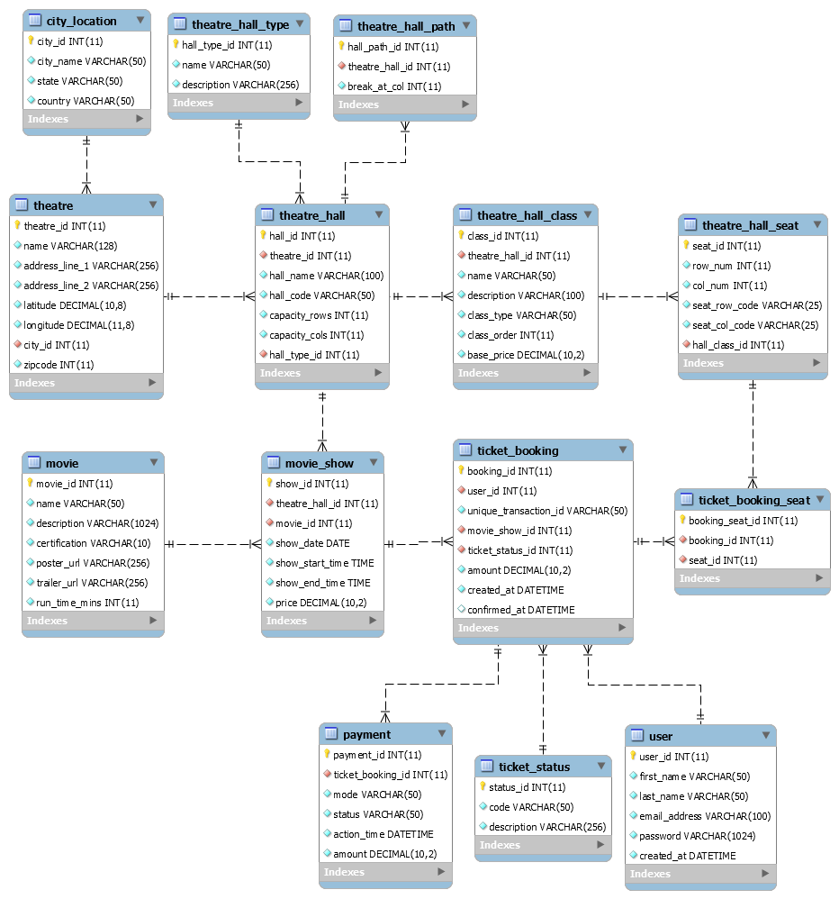

# Movie Ticket Booking System with Ticket Confirmation Broker

The system focuses on a use case where multiple users trying to book tickets to the same movie show.

```
There are two main components of the system,
 - A Ticket Booking System
 - A Ticket Confirmation System
```
#### Tools Used

- JMeter (To simulate concurrent bookings)

## Database Structure



## MovieTicketBookingSystem [🔗](./MovieTicketBookingSystem)

#### User SignIn API

The SignIn API request checks the credentials provided and in response provides a JWT Token for further API call authorization.

API | Method
----|-------
/api/user/signin | POST

##### Request JSON Body:

```
{
  "userName": <user-mail-id-registered>,
  "password": <user-password>
}
```
#### Movie Show Seat Availablity API

The Seat Availablity API lists the available seats for a particular movie show with the seats price and the Theatre's Hall Class details.

API | Method
----|-------
/api/movieshow/{movieShowId}/seatsavailable | GET

*Token Authorization is not required for this API*

#### Ticket Booking API

The booking API checks for the availability of the seats based on the criteria for a particular movie show and books the ticket.
The criteria for the seat availability check are,
 - Seats should have not been booked and paid earlier for the show.
 - Booking confirmed seats has to be paid within 2 minutes. If not, the seats will be made available for other users to book.
 - Seats that are currently in review will not be available for particular time(30s).

API | Method
----|-------
/api/ticket/book | POST

##### Request JSON Body:

```
{
  "movieShowId": <movie-show-id>,
  "seats": <array-of-seat-ids-pertaining-to-theatre-hall-and-hall-class>
}
```

The Ticket Booking API is protected by the JWT Token based Authentication.
The Token has to be added in the header section of the request.

```
Authorization: Bearer <token>
```

##### Response on Successful Ticket Blocking:

A unique request Id will be returned. The system is designed in such a way that the reqId shall be used for the Third party Payments as well as to push/track the ticket status through Websocket.

```
{
  "reqId": <unique-transaction-id>
}
```

## MovieTicketBookingConfirmationBroker [🔗](./MovieTicketBookingConfirmationBroker)

The Ticket Confirmation Broker System is an autonomous scheduled task that is configured to run at a fixed delay of one second between worker execution.

The role of the worker is to,
- Retrieve all the booked tickets that are yet to be reviewed
- Check and confirm/reject the tickets based on the criteria. The criteria are,
  - Seats are blocked on a first-come-first-served basis.
  - If the same seat is chosen by more than one booking, then the booking which blocks the max number of seats is confirmed.
  - If there is a tie between bookings, then one booking is randomly confirmed and other bookings are rejected.

Future Scope:
A Websocket instance which pushes the ticket booking status pertaining to the unique reqId.